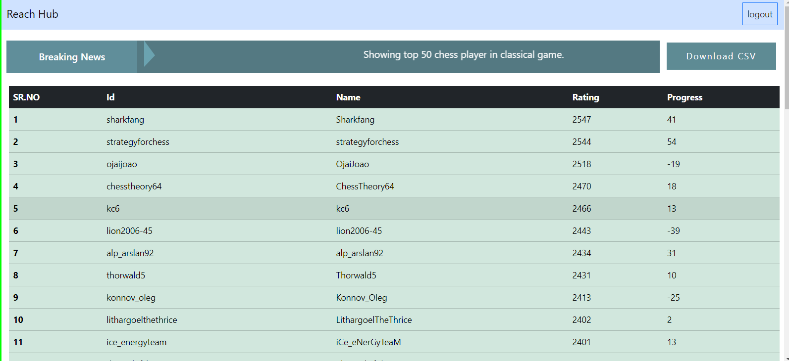
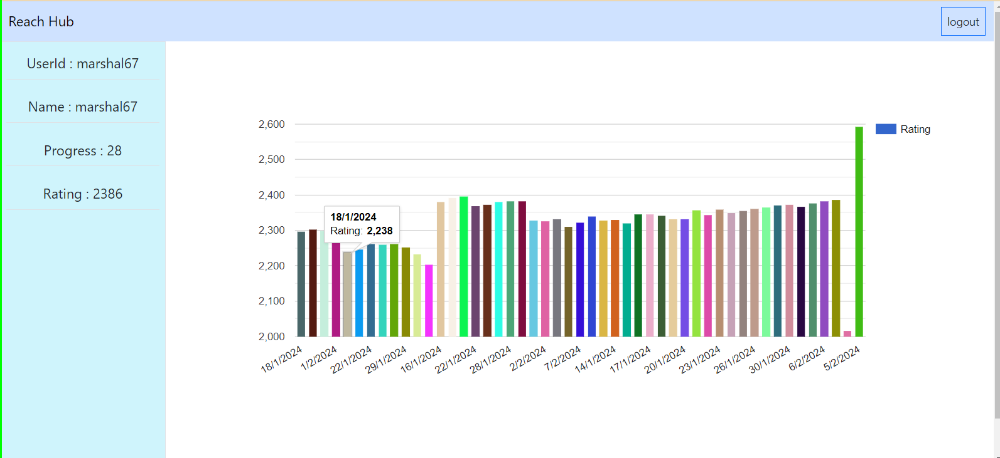
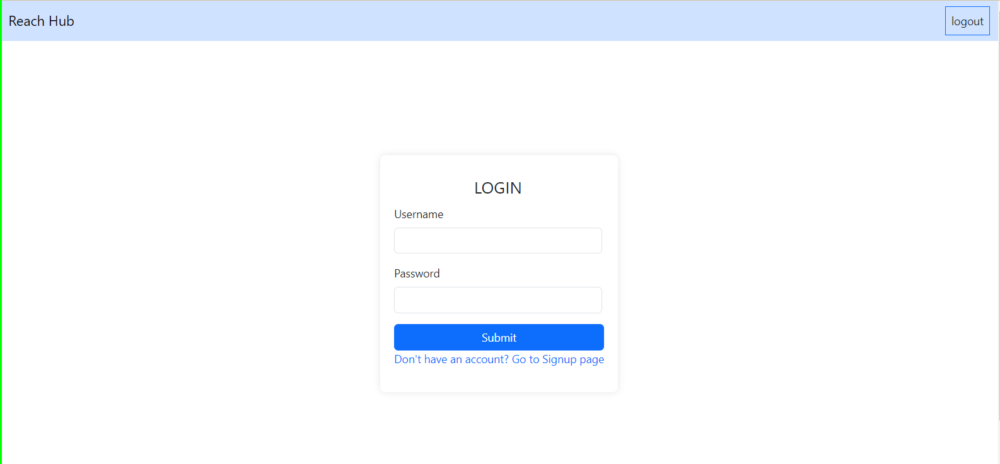
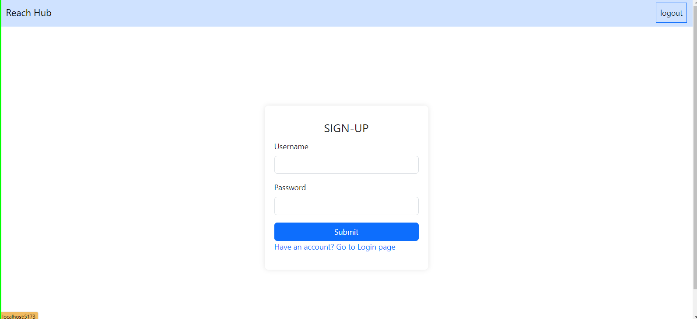

# reachhub

Evallo is a web application for sharing and managing content.

## Features

- Users can submit content including titles, descriptions, and files.
- Content can be downloaded or previewed.
- Responsive layout for various screen sizes.
- Support for various file types including images, text files, spreadsheets, and documents.

## Technologies Used

- Frontend:
  - React.js
  - CSS (with Flexbox/Grid for layout)
  - Axios (for making HTTP requests)
- Backend:
  - Node.js
  - Express.js
  - MongoDB (with Mongoose for object modeling)
  - Multer (for handling file uploads)
- Other:
  - Zod (for form validation)
  - React Router (for client-side routing)
  - Axios (for making HTTP requests)

## Getting Started

1. Clone the repository:

```bash
git clone https://github.com/pratikganjale55/Evallo.git
 ```

2. Install package:

```bash
 cd Client
 npm install 
 npm run dev

 cd Server 
 npm install 
 npm start
```
3.Add credientals as a DATABASE url (MongoDB) <br/>
4. Open http://localhost:3000 to view it in the browser  <br/>
5. Open http://localhost:8080 to backend run in the browser  <br/>






 
